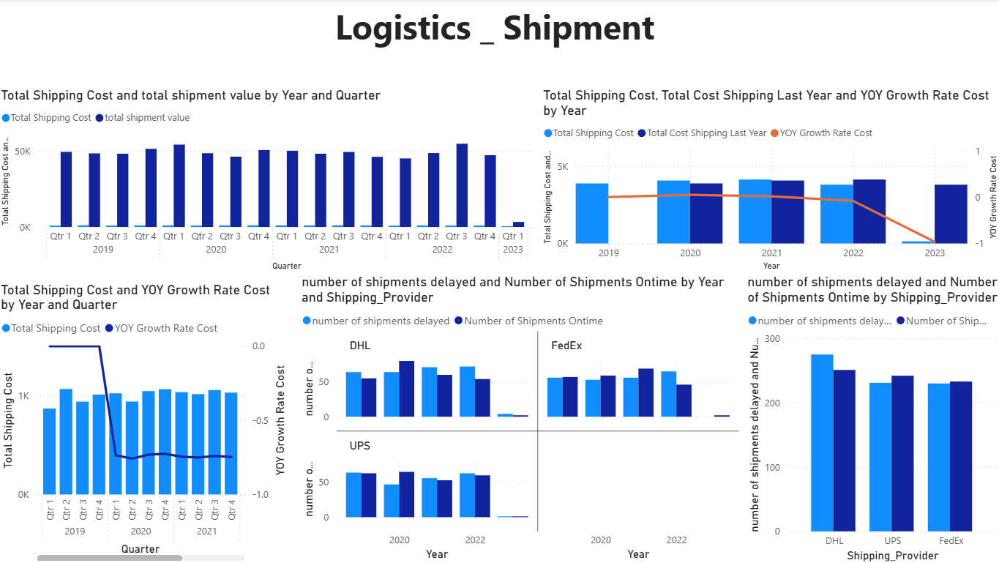

# Logistics Shipment Analytics - Power BI

## Project Overview

This project focuses on analyzing logistics and shipment performance using Power BI.

I built the dashboard to track shipping costs, shipment values, delivery performance, and shipping provider performance over time. It also helps compare current shipping costs with previous years and identify changes in shipment efficiency.

## Dashboard Overview

The dashboard provides an overall view of logistics and shipment performance across different years and quarters.

The analysis includes:

- Total Shipping Cost
- Total Shipment Value
- Shipping Cost by Year and Quarter
- Previous Year Shipping Cost
- YoY Shipping Cost Growth
- On-Time Shipments
- Delayed Shipments
- Shipping Provider Performance

## Cost Analysis

Shipping costs are analyzed by year and quarter to understand how logistics costs change over time.

The dashboard also compares current shipping costs with the previous year and calculates the YoY growth rate.

## Delivery Performance

The dashboard tracks the number of on-time and delayed shipments to provide a clearer view of delivery performance.

Shipment performance can also be compared across different shipping providers.

## Shipping Provider Analysis

The dashboard compares shipment performance across DHL, UPS, and FedEx.

This makes it easier to review the number of on-time and delayed shipments for each provider and identify differences in delivery performance.

## Tools Used

- Power BI
- Power Query
- DAX
- Data Modeling
- Data Cleaning and Transformation
- Data Visualization

## What I Worked On

For this project, I prepared and transformed the logistics data and created the calculations required for shipment and cost analysis.

I created measures for shipping costs, previous-year comparisons, YoY growth, and shipment delivery performance.

I also designed the dashboard to provide both an overall logistics view and a comparison of shipping provider performance.
